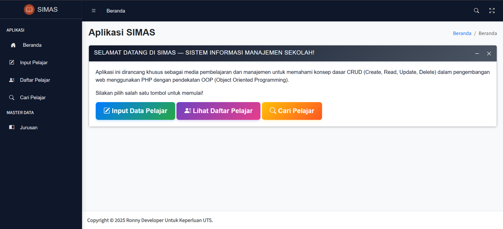

# SIMAS — Sistem Informasi Manajemen Sekolah

Aplikasi ini dirancang khusus sebagai media pembelajaran dan manajemen untuk memahami konsep dasar CRUD (Create, Read, Update, Delete) dalam pengembangan web menggunakan PHP dengan pendekatan OOP (Object Oriented Programming).

**FITUR SISTEM**

1. Input Data Pelajar
2. Edit Data Pelajar
3. Delete Data Pelajar
4. Input/Edit/Delete Master Data Jurusan
5. Feedback Error

